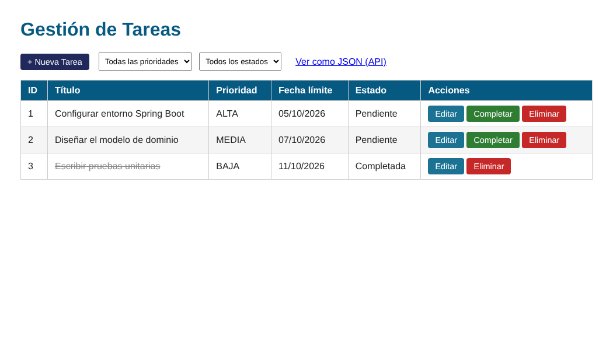
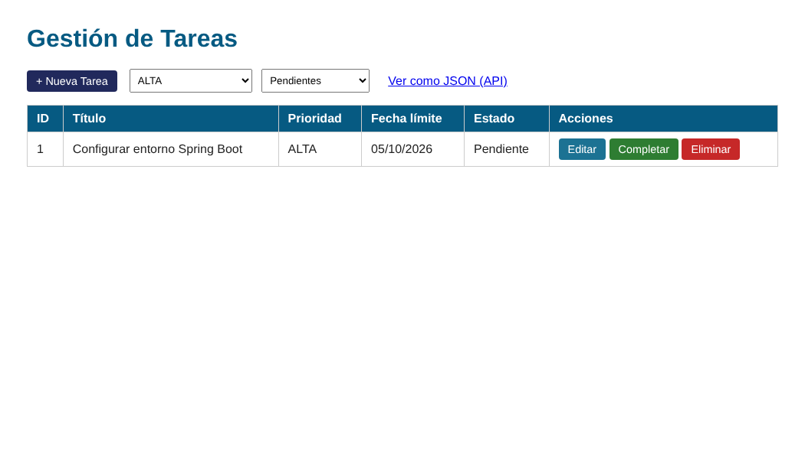
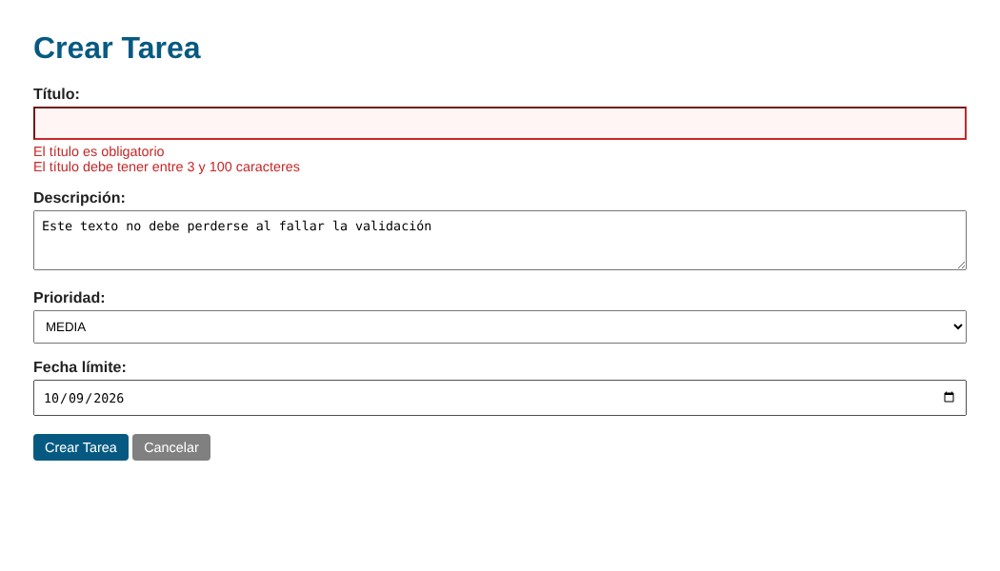
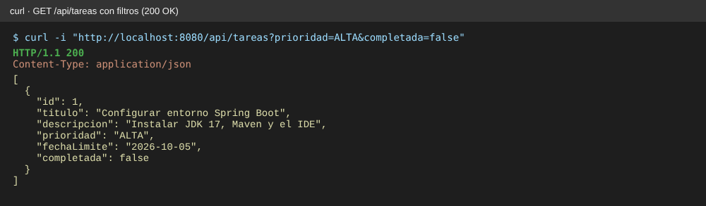
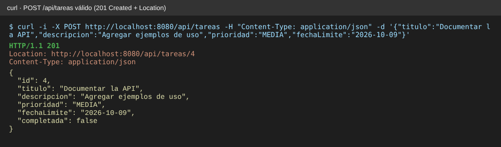
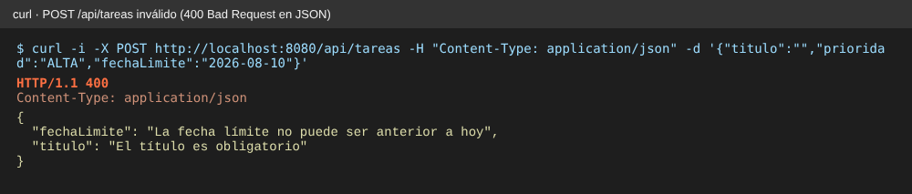
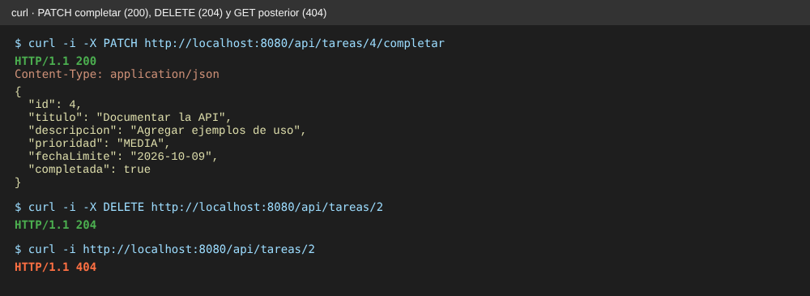
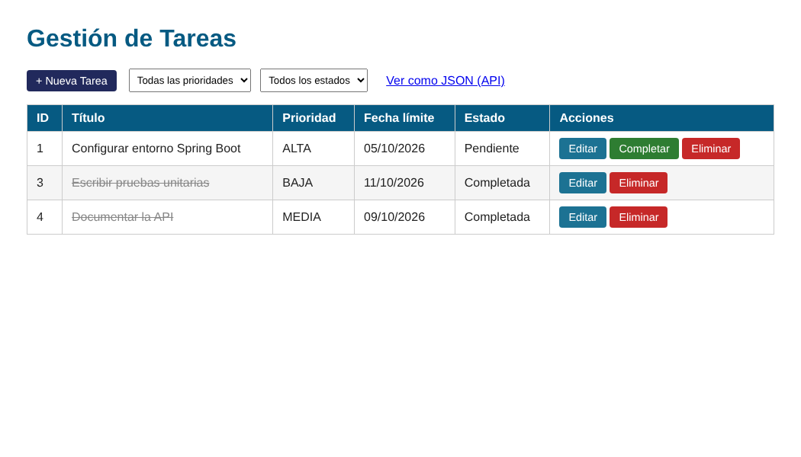

# Post-contenido — Unidad 7: Gestión de Tareas con Spring Boot

**Autor:** Santiago Carreño Calceto · Programación Web — Séptimo Semestre

## Descripción
Repositorio del laboratorio de la Unidad 7 de Programación Web. Un único
proyecto Spring Boot (`gestion-tareas`, un solo `pom.xml`, paquete raíz
`com.universidad.tareas`) con dos capas sobre el **mismo** `TareaService`:

- **Parte 1:** una vista web con Thymeleaf (`@Controller`).
- **Parte 2:** una API REST JSON (`@RestController`).

Como `TareaService` es un bean singleton administrado por Spring, la vista y la
API leen y escriben exactamente los mismos datos en memoria: lo que se crea,
completa o elimina por una capa se ve de inmediato en la otra.

**Tecnologías:** Java 17 · Spring Boot 3.2 · Spring Web MVC · Thymeleaf ·
Bean Validation (Hibernate Validator) · JUnit 5 + MockMvc · Maven Wrapper

## Prerrequisitos
- JDK 17 o superior (probado con JDK 21).
- Maven 3.8+ **o** el wrapper incluido (`mvnw` / `mvnw.cmd`), que no requiere instalar Maven.
- Navegador web y `curl` o Postman para la API.

## Estructura
```
carreno-post1-u7/
├── pom.xml, mvnw, mvnw.cmd, .mvn/wrapper/
├── capturas/                                  ← capturas de la vista y de la API
└── src/
    ├── main/java/com/universidad/tareas/
    │   ├── TareasApplication.java             ← @SpringBootApplication (paquete raíz)
    │   ├── model/       Tarea (Bean Validation), Prioridad
    │   ├── service/     TareaService (@Service, en memoria), TareaNoEncontradaException
    │   └── controller/  TareaController (vista), TareaApiController (API), ApiErrorHandler
    ├── main/resources/
    │   ├── application.properties
    │   ├── static/css/estilos.css
    │   └── templates/   tareas/lista.html, tareas/formulario.html, error/404.html, index.html
    └── test/java/...    TareaServiceTest (unitaria), TareaIntegracionTest (MockMvc)
```

## Parte 1 — Vista Thymeleaf con @Controller
`TareaController` expone `/tareas`:
- **Listar con filtros combinables** por `@RequestParam`: `?prioridad=ALTA&completada=false`.
- **Crear y editar** con un formulario validado con `@Valid` + `BindingResult`. Si hay
  errores, el formulario se vuelve a mostrar con el mensaje junto a cada campo y sin
  perder los datos escritos.
- **Completar y eliminar** como formularios POST, nunca como enlaces GET.
- **Post/Redirect/Get** en todas las operaciones que modifican datos, con un
  mensaje de confirmación (flash attribute) que sobrevive al redirect.
- Una tarea inexistente responde **404** con una página propia, no un error 500.

## Parte 2 — API REST con @RestController
`TareaApiController` expone `/api/tareas` e inyecta por constructor **la misma
instancia** de `TareaService`. `ApiErrorHandler` (`@RestControllerAdvice`)
convierte los errores de validación en **JSON 400** campo → mensaje.

| Método | URL | Éxito | Error | Descripción |
|---|---|---|---|---|
| GET | `/api/tareas` | 200 OK | 400 (filtro inválido) | Lista en JSON, filtrable con `?prioridad=` y/o `?completada=` |
| GET | `/api/tareas/{id}` | 200 OK | 404 Not Found | Tarea por id |
| POST | `/api/tareas` | 201 Created + `Location` | 400 Bad Request | Crea una tarea (el id lo asigna el servidor) |
| PUT | `/api/tareas/{id}` | 200 OK | 404 / 400 | Reemplaza todos los campos de la tarea |
| PATCH | `/api/tareas/{id}/completar` | 200 OK | 404 Not Found | Actualización parcial: `completada = true` |
| DELETE | `/api/tareas/{id}` | 204 No Content | 404 Not Found | Elimina la tarea |

Ejemplos:
```bash
curl "http://localhost:8080/api/tareas?prioridad=ALTA&completada=false"

curl -i -X POST http://localhost:8080/api/tareas -H "Content-Type: application/json" \
  -d '{"titulo":"Documentar la API","descripcion":"Agregar ejemplos","prioridad":"MEDIA","fechaLimite":"2026-12-10"}'

curl -i -X PATCH  http://localhost:8080/api/tareas/4/completar
curl -i -X DELETE http://localhost:8080/api/tareas/4
```

## Decisiones de diseño

**Comunes a ambas partes**
- **Inyección por constructor** (no `@Autowired` en el campo) en los dos
  controladores: la dependencia es explícita, el campo es `final` y la clase se
  puede instanciar en una prueba sin levantar Spring.
- **Un solo modelo validado** (`Tarea` con Bean Validation): la vista y la API
  aplican exactamente las mismas reglas, sin duplicarlas.
- **`@FutureOrPresent` en lugar de `@Future`** en `fechaLimite`: una tarea que
  vence el mismo día de su creación es válida.
- **Persistencia en memoria** en `TareaService` (la persistencia real con
  JPA/Hibernate llega en la Unidad 8). Como es un singleton usado por varios
  hilos a la vez, usa `ConcurrentSkipListMap` y `AtomicLong` en lugar de
  `LinkedHashMap` y `Long++`.
- **El id siempre lo asigna el servidor:** `crear()` ignora un id enviado por el
  cliente, y `actualizar()` no crea registros con ids inexistentes. Sin esto, un
  POST a la API con `"id": 1` sobrescribiría la tarea 1.

**Parte 1**
- **POST (no GET) para completar y eliminar:** un GET debe ser seguro. Si fuera
  un enlace, el precargador del navegador o un rastreador web podría borrar tareas
  solo con visitar la página. Un GET a esas rutas responde 405.
- **Errores de validación sin redirect** (se re-renderiza el formulario con
  `BindingResult`) y **PRG solo en el éxito**.
- **`completada` viaja oculto en el formulario de edición**, para que editar el
  título de una tarea ya completada no la vuelva a dejar pendiente.
- **`spring.mvc.format.date=iso`**: el `<input type="date">` envía `yyyy-MM-dd`.
  Sin esa propiedad, Spring usaría el formato corto del idioma del sistema y el
  binding de la fecha fallaría.
- **`TareaNoEncontradaException` con `@ResponseStatus(404)`** en vez de una
  `RuntimeException` genérica, que produciría un error 500.
- **Estilos en `static/css/estilos.css`** (convención de Spring Boot para
  recursos estáticos) en lugar de un bloque `<style>` repetido en cada plantilla.

**Parte 2**
- **PATCH (no PUT) para `/completar`:** PUT reemplaza el recurso completo y
  obligaría a reenviar título, descripción, prioridad y fecha solo para marcar
  una tarea como hecha; PATCH representa la modificación parcial de un campo.
- **201 Created con cabecera `Location` absoluta** (`ServletUriComponentsBuilder`)
  apuntando al recurso creado.
- **Validación separada por capa:** `BindingResult` en la vista, para volver a
  mostrar el HTML con los mensajes, y `@RestControllerAdvice` en la API, para
  responder JSON. El advice se limita con `assignableTypes` a
  `TareaApiController`, y también convierte en JSON 400 un JSON mal formado o un
  valor inválido (por ejemplo `"prioridad":"URGENTE"`).
- **Un mensaje por campo en la API:** un título vacío viola `@NotBlank` y
  `@Size(min = 3)` a la vez, y se devuelve el de `@NotBlank`.

## Pruebas automáticas
`mvn clean package` ejecuta **18 pruebas** (todas pasan):
- `TareaServiceTest` (5, unitarias, sin Spring): filtros combinados, id
  asignado por el servidor, actualizar inexistente, completar y eliminar.
- `TareaIntegracionTest` (12, MockMvc sobre el contexto real):
  - Códigos HTTP de la API: 200, 201 con `Location`, 400 en JSON, 204 y 404.
  - PUT y PATCH.
  - Que lo eliminado en la API desaparece de la vista y lo creado en la vista
    aparece en la API (mismo `TareaService`).
  - Formulario inválido con datos conservados, 404 al editar una tarea
    inexistente y 405 al completar por GET.
- `TareasApplicationTests` (1): el contexto completo arranca.

## Cómo compilar y ejecutar
1. Clonar: `git clone https://github.com/SantiagoCalceto/carreno-post1-u7.git`
2. Abrir la carpeta como proyecto Maven en IntelliJ IDEA (o VS Code).
3. Ejecutar:
   - Windows: `mvnw.cmd spring-boot:run`
   - Linux/macOS: `./mvnw spring-boot:run`
   - Con Maven instalado: `mvn spring-boot:run`
4. Abrir:
   - Vista web: http://localhost:8080/tareas
   - API REST: http://localhost:8080/api/tareas (con Postman o `curl`)

Para ver solo la Parte 1: `git checkout parte-1`.

## Capturas de pantalla

**Parte 1 — Lista de tareas**



**Parte 1 — Filtro combinado por @RequestParam (`?prioridad=ALTA&completada=false`)**



**Parte 1 — Formulario con error de validación (la descripción escrita se conserva)**



**Parte 2 — GET con filtros: 200 OK**



**Parte 2 — POST válido: 201 Created con Location**



**Parte 2 — POST inválido: 400 Bad Request con errores por campo en JSON**



**Parte 2 — PATCH completar (200), DELETE (204) y GET posterior (404)**



**Vista y API comparten el mismo TareaService:** la tarea 4, creada y completada
por la API, aparece tachada en la vista; la tarea 2, eliminada por la API, ya no
aparece.


